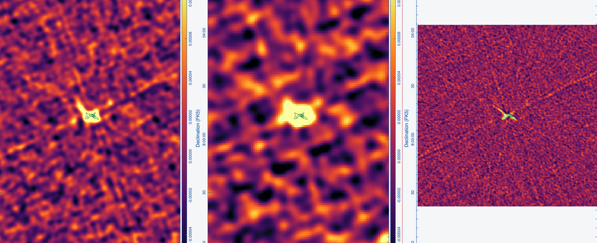

Preview of MCG+01-57-016 is shown below. The green contours represent the 1" image. The order of the images are 3" (left), 6" (middle), and 1" (right).

Thanks to Andrew Sargent for re-reducing these images and finding a more accurate flux density for this source! The new flux densities for each image are listed below:

| Resolution   | Flux Density (mJy) | Flux Density Error (mJy) | 
| ------------ | ------------------ | ------------------------ |
| 1" Image     | 0.814              | 0.045                    |
| 3" Image     | 1.240              | 0.059                    |
| 6" Image     | 1.367              | 0.065                    |

