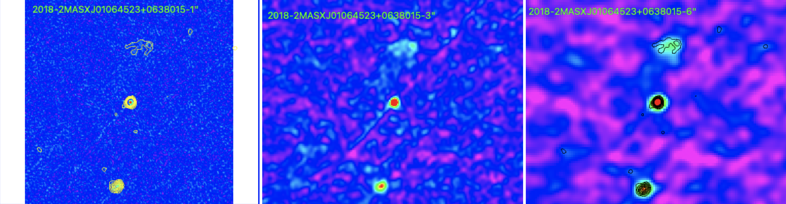

Preview of 2MASXJ01064523+0638015 is shown below. The contours represent the 3" image. 

Note: It seems that the sources above and below the central source are related to the central source. These sources may be left over remnants from an older active phase. To my knowledge 2MASXJ01064523+0638015 does not have any sort of radio lobes/jet associated with it. 

