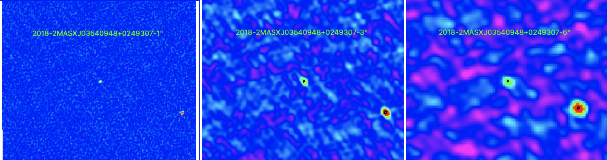

Preview of 2MASXJ03540948+0249307 is shown below. The black contours represent the 1" image. 

Note: The rightmost source has not been identified yet. This most likely is a background quasar, but further work needs to be done! This object has been added to the the Radio Companions List. 

