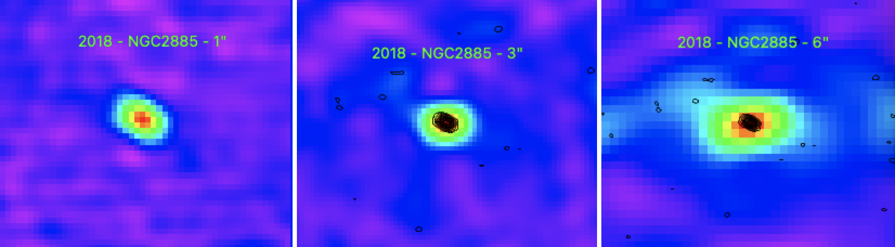

Preview of NGC2885 is shown below. The green contours represent the 1" image. The order of the images are 3" (left), 6" (middle), and 1" (right).

Thanks to Andrew Sargent for re-reducing these images and finding a more accurate flux density for this source! The new flux densities for each image are listed below:

| Resolution   | Flux Density (mJy) | Flux Density Error (mJy) | 
| ------------ | ------------------ | ------------------------ |
| 1" Image     | 1.079              | 0.022                    |
| 3" Image     | 1.138              | 0.041                    |
| 6" Image     | 1.167              | 0.059                    |

