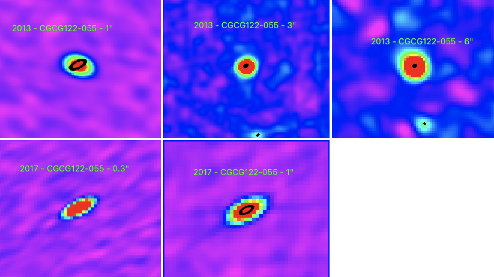

Preview of CGCG122-055 is shown below. The black contours represent the 2017 0.3" image. There is also another radio source directly to the south of CGCG122-055. Further work needs to be done to see if this is a jet lobe. 

