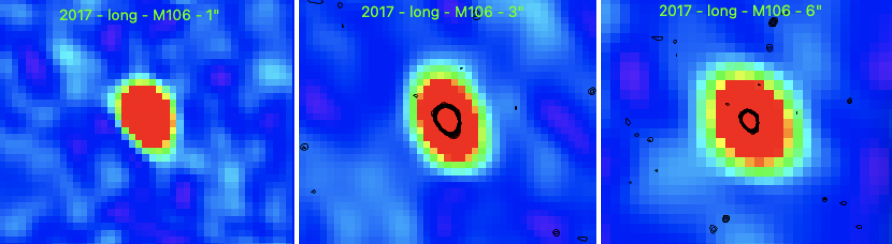

Preview of M106 is shown below. The green contours represent the 1" image. 

Thanks to Andrew Sargent for re-reducing these images and finding a more accurate flux density for this source! The new flux densities for each image are listed below:

| Resolution   | Flux Density (mJy) | Flux Density Error (mJy) | 
| ------------ | ------------------ | ------------------------ |
| 1" Image     | 2.853              | 0.029                    |
| 3" Image     | 3.186              | 0.059                    |
| 6" Image     | 3.662              | 0.091                    |
