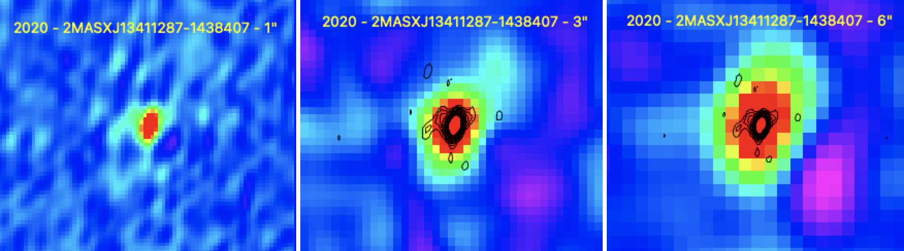

Preview of 2MASXJ13411287-1438407 is shown below. The black contours represent the 1" image. This source has faint radio lobes to the north and south of the central source. There is also a random radio source present in the bottom left. 

