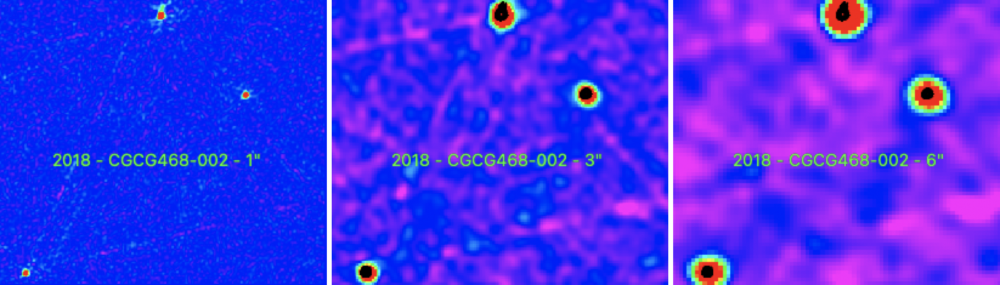

Preview of CGCG468-002 is shown below. The black contours represent the 1" image. The radio source that is the farthest to the right is CGCG468-002. The soruce that is at the top possibly is 2MFGC 4194. The bottom left source has yet to be identified. 

