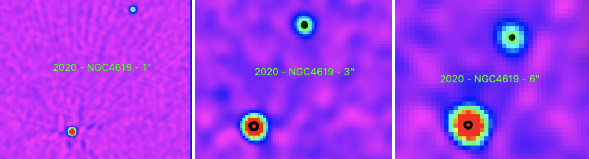

Preview of NGC4619 is shown below. The black contours represent the 1" image. 

The bottom source is NGC4619. The top source is most likely FIRST J124143.7+350404. This object seems to be either a foreground object, or an object that within NGC 4619.

